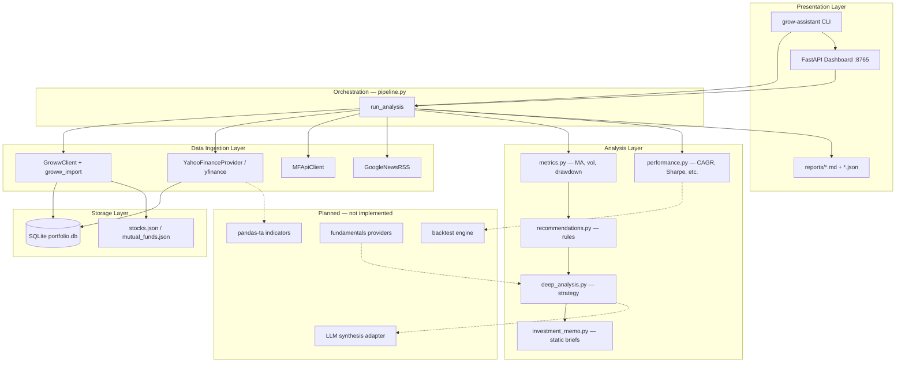

# Architecture & Roadmap

Study-informed evolution plan for **grow-trade-assistant** — a read-only Indian equity + MF portfolio analysis tool. This document maps the current system, gaps, risks, and a phased plan aligned with FinRobot/FinGPT-style agent separation, yfinance/FMP data patterns, pandas-ta deterministic indicators, and vectorbt/backtrader backtesting discipline.

**Scope:** Education and research only. No live trading without explicit paper-trading mode and risk limits.

---

## 1. Current Architecture Map

### 1.1 Layer diagram (target separation vs today)



### 1.2 Module inventory

| Layer | Module | Responsibility |
|-------|--------|----------------|
| Entry | `cli.py`, `__main__.py`, `scheduler.py` | Commands, EOD schedule |
| Entry | `web/app.py` | Local dashboard, import upload |
| Orchestration | `pipeline.py` | End-to-end `run_analysis()` |
| Ingestion | `groww_client.py`, `groww_import.py` | Broker holdings, LTP |
| Ingestion | `providers/yahoo_finance.py` | NSE prices, candles |
| Ingestion | `providers/mfapi.py` | MF NAV |
| Ingestion | `providers/news.py` | Headlines |
| Ingestion | `providers/base.py` | Fundamentals ABC (stub) |
| Analysis | `analysis/metrics.py` | Position + portfolio metrics |
| Analysis | `analysis/recommendations.py` | Rule-based actions |
| Analysis | `analysis/deep_analysis.py` | Combined strategy verdict |
| Analysis | `analysis/investment_memo.py` | Static Cursor briefs |
| Analysis | `analysis/performance.py` | **NEW** — deterministic perf stats |
| Domain | `domain/provenance.py` | **NEW** — claim types + source tracking |
| Backtest | `backtest/config.py` | **NEW** — validation plan schema |
| Storage | `cache/store.py` | SQLite snapshots, LTP, candles |
| Reporting | `report/deep_renderer.py`, `renderer.py` | MD + JSON output |
| Security | `auth.py`, `secrets.py` | Groww auth, Keychain |

### 1.3 Data flow (single run)

1. **Load settings** — `.env` + macOS Keychain credentials
2. **Holdings** — Groww API → fallback import/cache
3. **Prices** — Yahoo primary; Groww LTP overlay; avg-buy fallback
4. **Candles** — Yahoo 2Y daily → SQLite (MA50/200, drawdown)
5. **Metrics** — weights, P&L, trend, volatility
6. **Recommendations** — concentration + cooldown rules
7. **MF + news** — optional parallel fetches
8. **Deep analysis + memo** — strategy + education narrative
9. **Provenance + benchmark perf** — claim metadata + Nifty stats
10. **Write** — `reports/YYYY-MM-DD.{md,json}`

### 1.4 Claim type taxonomy (now in report JSON)

| Type | Meaning | Examples |
|------|---------|----------|
| `reported` | Primary source | Groww qty, Yahoo LTP, MF NAV |
| `calculated` | Deterministic formula | MA50, Sharpe, diversification score |
| `model_prediction` | Quant forecast | *(future)* regime signals |
| `llm_interpretation` | Narrative synthesis | Investment memo briefs |

---

## 2. Missing Features & Technical Risks

### 2.1 Missing features (vs reference systems)

| Area | Gap | Reference inspiration |
|------|-----|----------------------|
| **Layer separation** | Monolithic `pipeline.py`; no plugin registry | FinRobot agent groups |
| **LLM runtime** | Static briefs only; no evidence-linked synthesis | FinGPT, FinRobot, daily_stock_analysis |
| **Fundamentals** | Placeholder provider | SEC EDGAR, FMP, Finnhub |
| **Technical indicators** | Hand-rolled MA/vol only | pandas-ta, TA-Lib |
| **Backtesting** | Plan schema only; no engine | vectorbt, backtrader, Lean |
| **Walk-forward** | Not implemented | QuantStart best practices |
| **Corporate actions** | Not adjusted in candles | yfinance adj close, backtrader |
| **NSE calendar** | Weekday-only scheduler | Market holidays |
| **Survivorship** | Current holdings only | Historical universe |
| **Paper trading** | None (correctly disabled) | Explicit opt-in needed later |
| **Multi-broker** | Groww only | Future adapters |
| **Rate limiting** | Ad-hoc retries | Centralized client middleware |
| **Provenance per field** | Report-level block only | Per-metric lineage |
| **Uncertainty** | Counterpoints exist; no confidence bands | Research papers on LLM finance |

### 2.2 Technical risks

| Risk | Severity | Detail |
|------|----------|--------|
| **Yahoo as sole price source** | High | Unofficial API; gaps, delays, delisting |
| **Avg-buy price fallback** | High | Masks stale/missing quotes; inflates perceived value |
| **No LTP freshness in UI** | Medium | User may act on old cache (partially fixed: staleness warnings) |
| **SQLite single-writer** | Low | Fine for personal use; blocks multi-user |
| **Web dashboard unauthenticated** | Medium | Binds localhost but no auth on `/api/*` |
| **Static LLM briefs drift** | Medium | Aug-2026 context ages; not tied to filings |
| **Duplicate metric logic** | Medium | `metrics.py` vs `yahoo_finance.py` vol/MA |
| **Look-ahead in 1Y returns** | Medium | Uses full history including “future” from backtest POV |
| **Sector map static** | Low | Manual `SECTOR_MAP`; errors on new tickers |
| **News RSS reliability** | Low | No paywall handling; date parsing fragile |
| **Groww token daily approval** | Ops | Breaks unattended runs without token flow |
| **No integration tests for live APIs** | Low | Mocked in CI; production regressions possible |

---

## 3. Prioritized Implementation Plan

### Phase 0 — Foundation (current sprint) ✅ partial

- [x] `ClaimType` + `DataProvenance` in report JSON
- [x] `analysis/performance.py` deterministic metrics
- [x] `backtest/config.py` validation plan schema
- [x] Tests: performance, API failure, missing values, provenance
- [x] Staleness warnings on cached LTP

### Phase 1 — Layer extraction (2–3 weeks)

1. **`ingestion/` package** — move providers; add `IngestionResult` with per-source status
2. **`features/` package** — consolidate MA/vol/drawdown; add pandas-ta for RSI, MACD, ATR
3. **`pipeline/stages.py`** — compose stages; each returns typed result + warnings
4. **Unify calculations** — single source for indicators (remove duplicate in yahoo_finance)
5. **Benchmark block** — portfolio-weighted returns vs Nifty buy-and-hold

### Phase 2 — Provenance & data quality (2 weeks)

1. Per-metric `DataProvenance` on each position in JSON
2. `fetched_at` / `as_of_date` on every price and NAV
3. Data quality score (% holdings with live quote, candle depth)
4. Optional FMP / Finnhub adapter behind `MarketDataProvider`
5. NSE holiday calendar for scheduler

### Phase 3 — LLM synthesis adapter (2–3 weeks)

Pattern from FinRobot: **LLM never computes numbers**.

1. `llm/synthesizer.py` — input: structured JSON + provenance; output: markdown sections
2. Prompt contract: cite only provided fields; mark speculation
3. Optional runtime LLM (user API key) vs Cursor-maintained briefs
4. Store prompt hash + model id in provenance

### Phase 4 — Backtesting MVP (3–4 weeks)

1. `backtest/engine.py` using **backtesting.py** or **vectorbt**
2. Strategies: buy-and-hold, equal-weight rebalance, concentration trim rule
3. Friction model from `BacktestConfig` (commission, spread, slippage)
4. Walk-forward from `WalkForwardConfig`
5. Report: strategy vs benchmark table with all required metrics
6. Sensitivity CLI: `grow-assistant backtest --sensitivity`

### Phase 5 — Paper trading guardrails (future, explicit opt-in)

1. Env flag `PAPER_TRADING=true` required
2. Max order size, max daily trades, kill switch
3. No Groww order endpoints wired unless both flags set
4. Audit log in SQLite

---

## 4. Proposed Data Model & API Design

### 4.1 Core entities (Pydantic v2 recommended)

```python
# domain/models.py (proposed)

class Holding(BaseModel):
    trading_symbol: str
    exchange: str = "NSE"
    quantity: Decimal
    average_price: Decimal
    source: Literal["groww_api", "import", "cache"]
    as_of: datetime

class PriceQuote(BaseModel):
    symbol: str
    exchange: str
    last_price: Decimal
    previous_close: Decimal | None
    fetched_at: datetime
    source: str
    source_url: str | None
    claim_type: Literal["reported"] = "reported"
    is_stale: bool = False

class Candle(BaseModel):
    exchange: str
    symbol: str
    ts: datetime
    open, high, low, close, volume: Decimal
    adj_close: Decimal | None = None  # corporate-action adjusted

class FeatureVector(BaseModel):
    symbol: str
    as_of: datetime
    ma50, ma200, rsi14, atr14: Decimal | None
    volatility_30d_ann: Decimal | None
    max_drawdown_1y: Decimal | None
    claim_type: Literal["calculated"] = "calculated"
    inputs_ref: list[str]  # e.g. ["candles:NSE:RELIANCE"]

class Recommendation(BaseModel):
    symbol: str
    action: Literal["keep", "monitor", "research", "rebalance-candidate"]
    rank: int
    evidence: list[str]
    counterpoints: list[str]
    claim_type: Literal["calculated"] = "calculated"

class AnalysisReport(BaseModel):
    generated_at: datetime
    snapshot_id: int
    portfolio: PortfolioSummary
    deep_analysis: DeepAnalysisResult
    investment_memo: dict
    provenance: dict
    benchmark_performance: PerformanceMetrics | None
    backtest_validation_plan: dict
    data_warnings: list[str]
```

### 4.2 SQLite schema extensions (proposed)

```sql
-- Point-in-time fundamentals (when provider added)
CREATE TABLE fundamentals (
    symbol TEXT NOT NULL,
    metric TEXT NOT NULL,
    value REAL,
    period_end TEXT,
    filing_date TEXT,
    source TEXT,
    fetched_at TEXT,
    PRIMARY KEY (symbol, metric, period_end, source)
);

-- Provenance audit
CREATE TABLE data_lineage (
    id INTEGER PRIMARY KEY,
    report_date TEXT,
    field_path TEXT,
    claim_type TEXT,
    source TEXT,
    source_url TEXT,
    fetched_at TEXT
);

-- Backtest runs
CREATE TABLE backtest_runs (
    id INTEGER PRIMARY KEY,
    strategy TEXT,
    config_json TEXT,
    started_at TEXT,
    metrics_json TEXT
);
```

### 4.3 REST API (FastAPI — evolve `web/app.py`)

| Method | Path | Description |
|--------|------|-------------|
| GET | `/api/v1/status` | Health, analysis state, data freshness |
| GET | `/api/v1/report/latest` | Full `AnalysisReport` JSON |
| GET | `/api/v1/report/{date}` | Historical report |
| POST | `/api/v1/analyze` | Trigger run `{offline?: bool}` |
| POST | `/api/v1/import` | Groww file upload |
| GET | `/api/v1/holdings` | Current snapshot only |
| GET | `/api/v1/quotes/{symbol}` | Quote + provenance |
| GET | `/api/v1/features/{symbol}` | Calculated indicators |
| POST | `/api/v1/backtest` | *(Phase 4)* Run backtest |
| GET | `/api/v1/backtest/{id}` | *(Phase 4)* Results |

All responses include `claim_type` on numeric fields where applicable.

---

## 5. Test Strategy

### 5.1 Implemented tests

| File | Covers |
|------|--------|
| `test_metrics.py` | MA, trend, drawdown, recommendations |
| `test_performance.py` | CAGR, Sharpe, Sortino, Calmar, win rate |
| `test_missing_values.py` | NaN LTP, missing quotes, zero cost basis |
| `test_api_resilience.py` | Yahoo failure fallback, offline continue, staleness |
| `test_provenance.py` | Claim types, disclaimer |
| `test_pipeline.py` | Offline E2E |
| `test_cache.py` | SQLite CRUD |

### 5.2 Required additions (Phase 1–4)

```bash
# Calculations — golden files for indicator parity vs pandas-ta
tests/fixtures/golden/reliance_ma50.json

# API failures — httpx mock for Groww 401/429/500
tests/test_groww_client_errors.py

# Stale data — inject old fetched_at, assert warning in report
tests/test_stale_data_e2e.py

# Look-ahead — signal at t uses only data <= t-1
tests/test_backtest_no_lookahead.py

# Walk-forward — window boundaries
tests/test_walk_forward_splits.py
```

### 5.3 CI recommendation

- Unit tests: every PR, no network
- Nightly: smoke test against Yahoo (optional, rate-limited)
- Never commit live credentials; use `pytest-httpx` mocks

---

## 6. Security & Privacy Review

### 6.1 Strengths

- **Keychain storage** for Groww credentials (not plain `.env`)
- **Read-only scope** — no order endpoints
- **Secret redaction** in auth logging
- **Local-first** — portfolio data in gitignored `data/`
- **Disclaimer** in reports and README

### 6.2 Findings & recommendations

| Finding | Risk | Recommendation |
|---------|------|----------------|
| Web UI no auth | Local network exposure if bound `0.0.0.0` | Default `127.0.0.1`; optional API token |
| Uploads stored on disk | Malicious XLSX | Size limits (exists); virus scan optional |
| Reports contain holdings | PII/financial sensitivity | Document encryption-at-rest; exclude from git |
| Groww JWT in Keychain | Token theft = API access | Short-lived tokens; `secrets delete` documented |
| No TLS for local API | Low for localhost | OK for dev; TLS if remote |
| LLM briefs in source | Stale advice | Date-stamp; link to provenance |
| `.env` may hold secrets pre-migrate | Credential leak | `secrets migrate` + scrub |
| No audit log for analyze runs | Forensics gap | Log run id, sources, no secrets |

### 6.3 Privacy

- Do not send holdings to third-party LLMs without explicit user consent
- If LLM adapter added: redact account ids; user-controlled data sharing flag
- News fetch leaks symbol names to Google — document in provenance

### 6.4 Trading safety

- **No live execution** in current code — maintain
- Paper trading requires: `PAPER_TRADING=true` + `PAPER_TRADING_CONFIRM=I_UNDERSTAND` + hard notional caps
- Never present backtest CAGR as expected return

---

## 7. Backtesting & Validation Plan

### 7.1 Objectives

Validate that **rule-based suggestions** (concentration trim, trend monitor) would have improved risk-adjusted outcomes vs buy-and-hold on **historical data**, without look-ahead or survivorship bias.

### 7.2 Configuration (implemented in `backtest/config.py`)

| Parameter | Default | Rationale |
|-----------|---------|-----------|
| Commission | 10 bps/side | Indian discount broker |
| Spread | 5 bps | Liquid NSE names |
| Slippage | 10 bps | Conservative |
| Benchmark | NIFTY | Report comparison |
| Train / val / test | 504 / 63 / 63 days | ~2Y train, quarterly test |
| Embargo | 5 days | Prevent label leakage |

### 7.3 Required output metrics

CAGR, annualized volatility, Sharpe, Sortino, max drawdown, Calmar, turnover, win rate, profit factor, average exposure — computed in `analysis/performance.py`.

### 7.4 Validation protocol

1. **Baseline:** Nifty buy-and-hold and equal-weight portfolio buy-and-hold
2. **Strategy under test:** e.g. trim when weight > 15%, redeploy to index
3. **Walk-forward:** roll windows; aggregate out-of-sample metrics only
4. **Sensitivity:** ±50% friction, monthly vs quarterly rebalance
5. **Bias checks:** corporate-action-adjusted prices; include delisted if held
6. **Reporting:** side-by-side table; never single-number “expected return”

### 7.5 Recommended libraries

| Library | Use case |
|---------|----------|
| [vectorbt](https://github.com/polakowo/vectorbt) | Fast vectorized sweeps |
| [backtesting.py](https://kernc.github.io/backtesting.py/) | Readable strategy prototypes |
| [backtrader](https://github.com/mementum/backtrader) | Corporate actions, commissions |
| [Lean](https://github.com/QuantConnect/Lean) | Production-grade if scaling |

### 7.6 Research alignment

- LLM forecasts remain **uncalibrated narratives** until backtested (PMC9245389, Frontiers 2025)
- Chronological splits mandatory (SSRN 4489826)
- Report uncertainty and counterarguments in all strategy summaries

---

## Appendix: Reference Map

| # | Resource | Relevance |
|---|----------|-----------|
| 1 | daily_stock_analysis | Multi-source + LLM dashboard pattern |
| 2–5 | FinRobot, FinGPT, FinNLP, FinRL | Agent layering, data vs narrative |
| 6 | finllms | LLM benchmark caution |
| 7–13 | SEC, yfinance, FMP, Alpha Vantage, Polygon, Finnhub | Data adapter targets |
| 14–16 | pandas-ta, TA-Lib | Deterministic indicators |
| 17–22 | vectorbt, backtrader, Lean, backtesting.py | Backtest engines |
| 23–27 | Academic papers | Look-ahead, LLM limitations |

---

*Generated as part of architecture study — Aug 2026. Update this doc when phases complete.*
